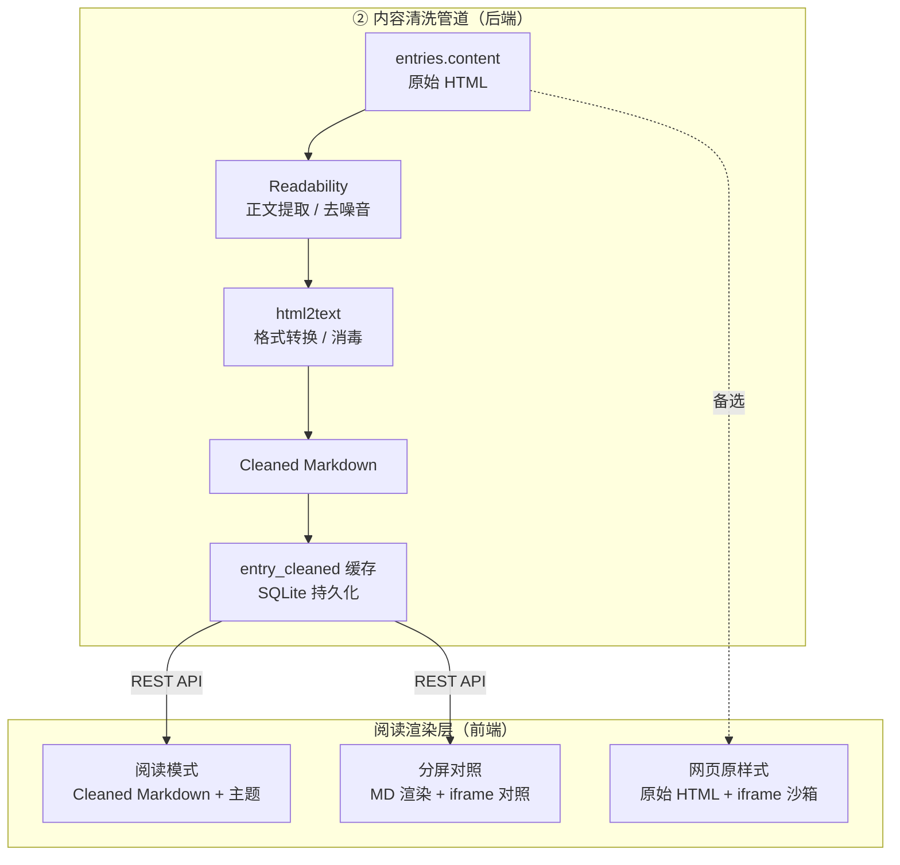
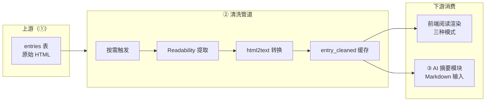
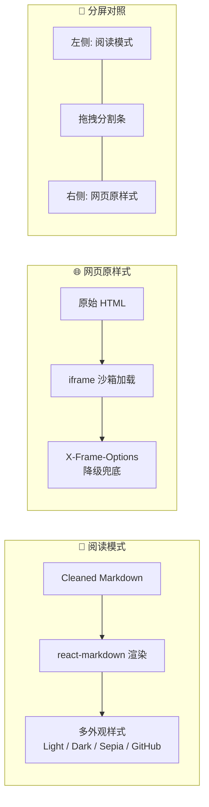

# 内容清洗 + 阅读渲染 —— 实现计划与技术选型报告

**负责人**：张璞格 · 2026-07-12  
**范围**：② — Cleaned HTML + Cleaned Markdown + 定制样式 + 阅读功能渲染  
**参考**：neolee/mercury · 团队整体 FastAPI + React + SQLite 架构  

---

## 1. 项目分工与衔接

参考团队整体架构（三端分离：后端 API + 前端 UI + Agent 独立），本人负责 **内容清洗（②）** 与 **阅读功能渲染**：

| 角色 | 职责 | 衔接机制 |
| :--- | :--- |  :--- |
| 本人 | 内容清洗管道（原始 HTML → Cleaned HTML → Cleaned Markdown）；阅读渲染（阅读模式/多外观样式/网页原样式/分屏对照）  | 消费 ① 的 `entries.content`；为 ③ AI 模块提供清洗后 Markdown；向前端阅读面板提供清洗后内容 |

**分工边界**：
- **上游（杨云天·①）**：Feed 拉取、解析、入库 → 提供原始 `entries.content`（HTML 片段）和元数据
- **下游（刘至晗·③④）**：AI 摘要/翻译 → 消费②产出的 Cleaned Markdown

**本期不做**：笔记/文摘导出（⑦）、标签系统（⑧）、用量分析（⑥）等选做功能。

---

## 2. 整体架构（三端分离 + Web 优先）

**② 相关数据流**：
1. 前端/Agent 请求 `/api/entries/{id}/cleaned`
2. 后端检查 `entry_cleaned` 缓存表：
   - 命中且原始内容未变 → 直接返回
   - 未命中或脏 → 触发清洗管道，写入缓存后返回
3. 前端根据返回数据渲染对应阅读模式

本人 ② 相关数据流：
① entries.content → ② 清洗管道 → entry_cleaned 缓存 → 前端阅读渲染 / ③ AI 摘要输入

text

---

## 3. 先做网页端

第一阶段选定 Web（localhost）理由如下：

1. **平台中立可验收**：浏览器打开即可演示，不强制每人装 Xcode / 同一套桌面环境
2. **分工清晰、可并行**：张璞格主攻「清洗管道 + 阅读渲染」；杨云天主攻「Feed 解析/Sync」；刘至晗主攻「AI Agent」
3. **与最终交付路径兼容**：功能稳定后，Electron/Tauri 将「本地后端 + 前端静态资源」打成 .exe 等安装包，② 相关业务代码无需按 OS 重写
4. **联调与留痕方便**：127.0.0.1 + FastAPI + OpenAPI 接口契约清楚，便于 AI 开发过程留痕

本模块 Web → 桌面的迁移策略：
- 清洗管道是**纯 Python 业务逻辑**，与运行环境无关
- 前端 React 构建产物的 `dist/` 直接作为 Electron 静态资源
- 唯一需适配的是 SQLite 路径（使用平台无关的 `pathlib.Path` + `appdirs`）

---

## 4. 核心能力拆解

### 4.1 内容清洗（后端核心）

| 步骤 | 输入 | 处理逻辑 | 产出 | 异常降级 |
| :--- | :--- | :--- | :--- | :--- |
| **① 正文提取** | 原始 HTML（含噪音） | Readability 算法分析 DOM，识别主内容区，剔除导航/侧栏/广告 | Cleaned HTML（仅正文） | 提取失败 → 降级为 DOMPurify 消毒后的原始 HTML，标记 `status=partial` |
| **② 链接补全** | Cleaned HTML 中的相对路径 | 自动将相对 URL 补全为绝对 URL（基于原文 `source_url`） | Cleaned HTML（链接完整） | 补全失败 → 保留相对路径，不影响主流程 |
| **③ 格式转换** | Cleaned HTML | 将 HTML 标签映射为 Markdown 语法（标题/段落/列表/表格/代码块/引用） | Cleaned Markdown | 转换失败 → 保留 Cleaned HTML，Markdown 字段置空 |
| **④ 缓存持久化** | Cleaned HTML + Markdown | 写入 `entry_cleaned` 表；若 `entries.updated_at` 更新则自动失效 | 数据库记录 | 写入失败 → 记录日志，返回内存结果 |

### 4.2 阅读功能（前端展示）

| 显示模式 | 数据源 | 渲染方式 | 安全策略 |
| :--- | :--- | :--- | :--- |
| **阅读模式** | Cleaned Markdown | Markdown 渲染引擎（支持 GFM） | 渲染引擎自带 XSS 防护；代码块语法高亮 |
| **网页原样式** | 原始 HTML | iframe 沙箱加载 | `sandbox="allow-scripts allow-same-origin"`；X-Frame-Options 拦截时降级为“新窗口打开” |
| **分屏对照** | 左：Cleaned HTML / 右：原始 HTML | 左右弹性容器 + 拖拽分割条 | 左右独立隔离；右侧加载失败不影响左侧 |

### 4.3 外观样式（阅读模式的多重皮肤）

使用 CSS 变量实现主题切换，无需重载页面：

| 样式名称 | 配色特征 | 适用场景 |
| :--- | :--- | :--- |
| **Light（浅色）** | 白底黑字，柔和阴影 | 日间阅读 |
| **Dark（深色）** | 深灰底浅灰字 | 夜间阅读 |
| **Sepia（怀旧）** | 米黄底棕字 | 长时间沉浸阅读 |
| **GitHub 风格** | GitHub Markdown 样式 | 技术文档阅读 |

> 用户对主题、字号、行距、字体的选择持久化至本地 `reading_preferences` 表，应用重启后自动恢复。

---

## 5. 数据模型扩展

在 ① 的 `entries` 表基础上扩展两张辅助表，不修改主表结构：

### 5.1 清洗缓存表（entry_cleaned）

| 字段 | 类型 | 说明 |
| :--- | :--- | :--- |
| `entry_id` | INTEGER PRIMARY KEY | 关联 entries 表 |
| `cleaned_html` | TEXT | 清洗后的 HTML（用于分屏对照） |
| `cleaned_markdown` | TEXT | 清洗后的 Markdown（用于阅读模式 + AI 输入） |
| `word_count` | INTEGER | 正文字数统计 |
| `status` | TEXT | 枚举: 'success' / 'partial' / 'failed' |
| `updated_at` | TIMESTAMP | 最后更新时间 |

**缓存策略**：
- 唯一索引：`entry_id`（保证一篇文章仅一条清洗记录）
- 脏标记：比对 `entries.updated_at` 与 `entry_cleaned.updated_at`，原始内容更新则重洗

### 5.2 阅读偏好表（reading_preferences）

| 字段 | 类型 | 说明 |
| :--- | :--- | :--- |
| `id` | INTEGER PRIMARY KEY | 固定为 1（全局单例） |
| `theme` | TEXT | 主题名: 'light' / 'dark' / 'sepia' / 'github' |
| `font_size` | INTEGER | 字号（像素） |
| `line_height` | REAL | 行距倍率 |
| `font_family` | TEXT | 字体族 |
| `display_mode` | TEXT | 显示模式: 'reader' / 'original' / 'split' |
| `split_ratio` | REAL | 分屏比例（0~1） |

---

## 6. 技术选型与迁移思路

### 6.1 选用栈及理由

| 用途 | 选型 | 说明 |
| :--- | :--- | :--- |
| **正文提取** | `readability-python` | Mozilla Readability 的高保真 Python 移植，Firefox 阅读模式同源算法，实战验证充分 |
| **HTML 消毒** | `DOMPurify`（前端）+ `bleach`（后端备选） | 前端渲染前消毒防 XSS；DOMPurify 为 React 生态标准方案 |
| **HTML→Markdown** | `html2text` | Python 成熟库，长期维护，Debian 官方收录；可精细控制链接/图片/表格保留策略 |
| **Markdown 渲染** | `react-markdown` + `remark-gfm` | React 生态标准；支持 GFM 表格、任务列表、脚注等 |
| **代码高亮** | `react-syntax-highlighter` | 配合 Markdown 渲染，支持多种编程语言 |
| **样式主题** | CSS Variables | 无需重新编译，运行时切换主题 |

### 6.2 从 Mercury 原栈到 Web 的迁移思路

Mercury（macOS 原生）技术栈是 Swift + SwiftUI + 原生 WebKit 渲染。我们的策略是 **“先抽象领域行为，再按层替换实现”** ：

1. **行为抽象**：正文提取、格式转换、多种渲染模式、主题切换——这些与 UI 框架无关
2. **层替换**：
   - 表现层：SwiftUI → React
   - 清洗服务：Swift 原生 HTML 解析 → Python + readability-python
   - 渲染引擎：WebKit → react-markdown + iframe
   - 存储：保持 SQLite，降低心智迁移成本
3. **控制边界**：② 阶段聚焦清洗与渲染，不涉及 AI 摘要/翻译和笔记导出等后续功能，避免迁移范围失控

> 原则：复用“领域模型与产品行为”，替换“平台绑定实现”——既满足作业跨平台要求，又避免从零重写一套 macOS 原生应用。

---

## 7. API 接口契约

| 方法 | 路径 | 入参 | 出参 | 说明 |
| :--- | :--- | :--- | :--- | :--- |
| GET | `/api/entries/{entry_id}/cleaned` | 路径: entry_id | `entry_id`, `cleaned_html`, `cleaned_markdown`, `word_count`, `status` | 缓存命中直接返回；缓存缺失同步触发清洗（超时 3s），超时则返回 `status=processing`，前端稍后重试 |
| POST | `/api/preferences/reading` | 主体: `theme`, `font_size`, `line_height`, `font_family`, `display_mode`, `split_ratio` | 操作成功状态 | 全量替换偏好设置 |
| GET | `/api/preferences/reading` | 无 | 当前完整偏好对象 | 用于前端初始化恢复用户习惯 |

**接口规范**：
- 所有响应均含 `code` 和 `msg` 字段
- 清洗失败时返回 `200` + `status=partial` + `cleaned_html` 为消毒后原始内容（保证前端不报错）
- 字段变更必须经团队评审，**严禁 AI 擅自扩展返回字段**（写入 AGENTS.md）

---

## 8. 阶段规划（P0-P2）

与团队整体节奏对齐：

| 阶段 | 目标 | 主要产出 | 验收标准 | 依赖 |
| :--- | :--- | :--- | :--- | :--- |
| **P0** | 清洗管道连通性 | 集成 readability + html2text；单篇文章清洗入库；`/api/entries/{id}/cleaned` 可用 | Swagger UI 中调用接口，返回结构化 Markdown | ① entries 表有数据 |
| **P1** | 阅读模式基础渲染 | 前端展示清洗后 Markdown；浅色/深色主题切换；偏好读写 | 打开文章列表进入阅读模式，排版整洁；刷新保留主题 | P0 完成 |
| **P2** | 完整阅读体验 | 三种显示模式；4 种主题；分屏拖拽；iframe 降级兜底 | 单篇文章切换三种模式验证布局；分屏比例可调 | P1 完成 |
| **后续** | 联调收口 | 与③ AI 模块联调（Markdown 输入）；Electron 打包验证 | 清洗后 Markdown 可被摘要 Agent 正确消费 | P2 完成 |

**近期优先事项**：
1. 用 Mercury starter OPML（约 11 个公开源）中的文章样本测试 readability 提取效果
2. 与前端约定条目清洗后 JSON 字段结构（`cleaned_html` / `cleaned_markdown`），减少返工
3. 准备 5 个不同布局的 RSS 源作为清洗管道的回归测试集

---

## 9. 风险与应对

| 风险 | 应对 |
| :--- | :--- |
| **Readability 提取失败**（某些动态/非标准页面） | 降级为 DOMPurify 消毒后的原始 HTML，标记 `status=partial`；前端显示“本文清洗不完整”提示 |
| **html2text 转换丢失格式** | 精细调优配置项（`body_width=0`、`ignore_links=False`、`ignore_images=False`）；若失败保留 Cleaned HTML |
| **iframe 被 X-Frame-Options 拦截** | 降级为“无法嵌入，点击在新窗口打开原文”按钮；不影响阅读模式 |
| **分屏渲染大文章性能问题** | 前端采用虚拟滚动或分段渲染，仅渲染可视区域 |
| **SQLite 路径在打包后变化** | 强制使用 `pathlib.Path` + `appdirs` 获取平台数据目录，**禁止 AI 硬编码路径** |
| **XSS 注入** | 前端 DOMPurify 消毒 + 后端 bleach 双重保障；**严禁前端 `dangerouslySetInnerHTML` 渲染未消毒内容** |
| **清洗性能阻塞 Sync** | 清洗为**按需触发**（首次阅读时），不阻塞 ① 的同步流程 |

---

## 10. AI 开发约束与协作规范（GPT + Copilot CLI + DeepSeek）

采用 **GPT（规划）+ Copilot CLI  + DeepSeek API（推理）** 的 AI 辅助开发范式，针对本模块设立以下约束：

### 10.1 核心约束（写入 AGENTS.md）

| 类别 | 约束内容 |
| :--- | :--- |
| **提取库锁定** | 正文提取仅允许 `readability-python`；禁止自研正则或引入 Newspaper3k/Boilerpy |
| **转换库锁定** | Markdown 转换仅允许 `html2text`；必须保留链接/图片/表格 |
| **异常处理** | 严禁 `try...except: pass`；所有异常必须 `logger.error` 记录堆栈 |
| **路径规范** | 严禁 `os.path.join` 硬编码；必须使用 `pathlib.Path` |
| **XSS 红线** | 严禁 `dangerouslySetInnerHTML` 渲染未消毒内容；iframe 必须配置完整 `sandbox` 属性 |
| **单函数长度** | 清洗管道必须拆分为 `extract` / `sanitize` / `convert` / `cache` 四个独立阶段，单函数不超过 80 行 |

### 10.2 标准协作流程

| 步骤 | 主导 | 动作 | 产出 |
| :--- | :--- | :--- | :--- |
| **Step 1 规划** | 人类 + GPT | 向 GPT 描述当日目标（如“实现 P0 异常降级”），输出 5-7 步子任务 | 更新 PLAN.md |
| **Step 2 编码** | 人类 + Copilot/DeepSeek | 复制单步任务 + “参照 AGENTS.md 约束”作为 Prompt | 具体代码文件 |
| **Step 3 反馈** | 人类（主导） | 用真实 RSS 文章测试，将“预期 vs 实际”差异**精确**反馈给 AI | 调试日志 + 修改指令 |
| **Step 4 重构** | 人类 + Copilot | 每完成 3-4 功能点，指令检查坏味道（如“找出所有吞异常代码”） | 代码整洁度提升 |

### 10.3 Prompt 模板

- **清洗规则调整**：`"目标：修改清洗管道增加 <figure> 标签保留。当前行为被忽略，期望产出为 '![图片] - 注释'。请先口头给出修改方案，确认后再写代码。"`
- **清洗失败调试**：`"文章 [URL] 清洗状态 failed，日志显示 Readability returned empty。请分析 min_text_length 阈值还是属性干扰？罗列 3 种可能原因。"`
- **GUI 布局问题**：`"分屏模式下右侧 iframe 不随窗口缩放。禁止直接改代码，先罗列 3 种可能原因，确认后再动手。"`

### 10.4 团队接口协同

- P0 阶段提交 `openapi_cleaning.yaml`（由 GPT 按前述 API 规划生成）至仓库根目录
- ③ AI 模块的 AI 读取该 YAML 中的响应结构作为输入依赖
- ① 的 AI 不得修改该接口字段
- 任何字段变更走 PR 评审，**严禁 AI 擅自扩展返回字段**

---

## 11. 小结

本模块以 Web 先行的方式落地必做②与阅读功能，是在“对齐 Mercury 产品体验”与“作业平台中立/可打包”之间的务实路径：将 Swift 原生能力按层映射到 FastAPI + React，而不是硬移植源码。

**核心交付**：两段式清洗管道（Readability 提取 + html2text 转换）、三种阅读模式（阅读模式/原样式/分屏对照）、四套外观样式（Light/Dark/Sepia/GitHub）、偏好持久化。

**实施节奏**：与团队 P0-P2 阶段深度绑定——P0 验证清洗连通性，P1 完成阅读模式基础渲染，P2 落地完整体验与分屏对照。待 ① 的订阅同步稳定后，本模块可独立并行开发，仅依赖 API 联调。

**AI 开发规范**：通过 AGENTS.md 硬约束 + 标准化 Prompt 模板 + 人类监督检查点，将 AI 的弱项（GUI/环境坑/边缘 case）通过制度性栅栏规避。所有 AI 生成代码在 Commit 中留痕，满足作业⑥“Coding Agent 留痕”要求。待 ② 稳定后，进入 Electron 打包验证，业务代码无需按 OS 重写，直接交付跨平台桌面应用。