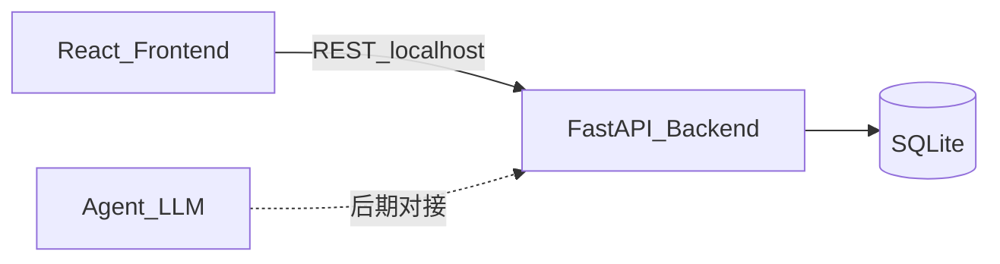
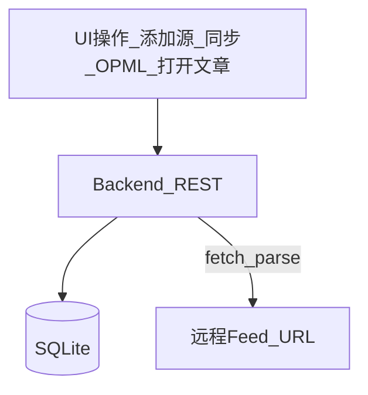
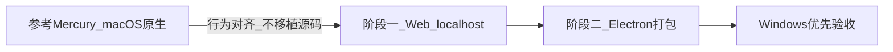
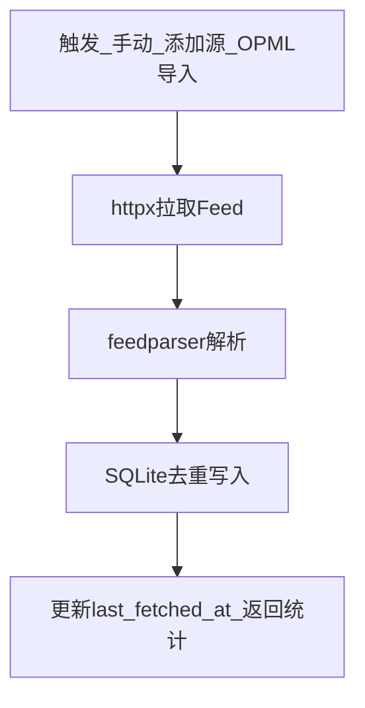
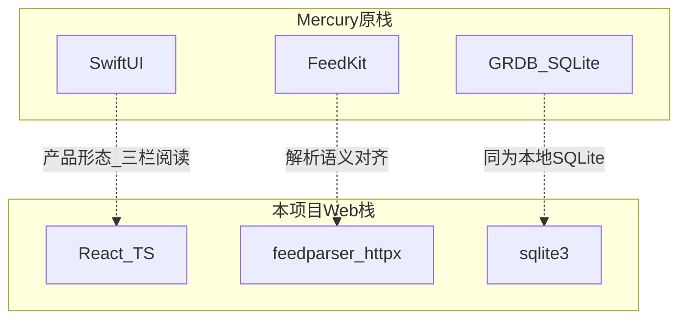
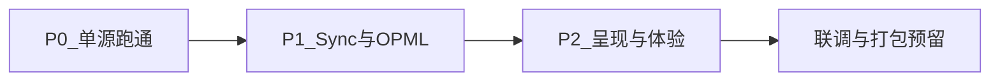

# 基础功能实现计划与技术选型

> 负责人：杨云天 · 2026-07-12  
> 范围：作业必做① — Feed / OPML 解析 + Sync + 内容呈现  
> 参考：[neolee/mercury](https://github.com/neolee/mercury)

---

## 1. 项目分工

参考 Mercury，自研**本地优先、跨平台** RSS 阅读器：先 Web 三端联调，后期再打包（优先 Windows）。

| 角色 | 职责 | 作业能力 |
|------|------|----------|
| **杨云天（本人）** | Feed / OPML / Sync / 内容呈现；后端 API + 本地库 | **必做①** |
| 前端 | 订阅与阅读 UI，消费 REST | 联调① |
| Agent | 摘要 / 翻译等 LLM | ③④（本期不依赖） |

本人本期不做：内容清洗②、AI、选做笔记/标签等。

---

## 2. 整体架构（三端分离）

- 前端只调 API；后端负责拉 Feed、解析、入库与呈现数据。  
- Agent 独立，①阶段不接入。  
- 后期 Electron 包装同一套 localhost 服务，即可跨 OS 交付。

本人①相关数据流：

---

## 3. 实现计划（必做①）

### 3.1 为何先做网页端

作业要求**平台中立**（Windows / Linux / macOS），而参考项目 Mercury 是 **macOS + SwiftUI 原生应用**，不能直接作为交作业的跨平台成品，也不利于组内非 Mac 同学共同开发与验收。

因此第一阶段选定 **Web（跑在 localhost）**，理由如下：

1. **平台中立可验收**：浏览器打开即可演示，不强制每人装 Xcode / 同一套桌面环境。  
2. **分工清晰、可并行**：本人主攻「解析 / 同步 / 存储」后端链路；前端同学独立迭代三栏 UI；Agent 同学后期再挂服务。  
3. **与最终交付路径兼容**：功能稳定后，用 Electron / Tauri 把「本地后端 + 前端静态资源」打成 `.exe` 等安装包，业务代码基本不用按 OS 重写。  
4. **联调与留痕方便**：`127.0.0.1` + FastAPI 自带 OpenAPI，接口契约清楚，便于 Coding Agent / Git 过程文档留痕。

### 3.2 能力拆解与数据模型

| 能力 | 要做成什么 |
|------|------------|
| Feed 解析 | 输入 Feed URL，拉取并解析 RSS/Atom，得到源信息与条目并入库 |
| OPML | 扁平导入（批量 upsert）/ 导出 OPML 2.0 |
| Sync | 单源与全量同步；`(feed_id, guid)` 去重；更新 `last_fetched_at` |
| 内容呈现 | 列表 + 详情展示 Feed 自带 `summary`/`content`；打开原文、标记已读 |

最小表结构：

- **feeds**：`id`, `title`, `feed_url`(UNIQUE), `site_url`, `last_fetched_at`, `created_at`  
- **entries**：`id`, `feed_id`, `guid`, `url`, `title`, `author`, `published_at`, `summary`, `is_read`, `created_at`  

约束与策略：唯一索引 `(feed_id, guid)`；Sync 使用 `ON CONFLICT DO NOTHING`（本阶段不覆盖已有正文，避免打乱已读）；订阅为扁平列表（对齐当前 Mercury，暂不做文件夹）。

### 3.3 同步与模块

同步主路径：

后端模块示意：`services/`（feed_parser / opml / sync）+ `routers/`（feeds / entries / opml / sync），由 FastAPI 统一挂载；前端经 REST 消费，不直连数据库。

内容呈现（①内）：主路径渲染 Feed 摘要（HTML 消毒）；原文可外链或 iframe（受 X-Frame 限制时降级）。完整 Readability → Markdown 清洗属**必做②**，①只预留扩展。

### 3.4 验收标准（①）

- 可添加真实 RSS/Atom 源并入库  
- OPML 可导入、导出且可再导入  
- 单源/全量 Sync 可重复执行且不产生重复条目  
- 列表与详情可读，可打开原文、标记已读  
- 全程无需账号，数据在本地 SQLite  

---

## 4. 技术选型与「语言/栈」迁移思路

### 4.1 选用栈（①相关）及理由

| 用途 | 选型 | 说明 |
|------|------|------|
| 后端框架 | Python FastAPI | REST + 自带 OpenAPI，适合 localhost 联调 |
| 本地存储 | SQLite | 本地优先、单文件、零额外部署 |
| Feed 解析 | `feedparser` | RSS/Atom 成熟稳定 |
| HTTP 拉取 | `httpx` | 超时与并发同步 |
| OPML | `xml.etree` 自研 | 扁平 `xmlUrl`/`htmlUrl`，无额外依赖 |
| 前端 | React + Vite + TypeScript | 三栏阅读器 UI，构建快 |
| HTML 安全 | DOMPurify | 防 XSS |
| 后期包装 | Electron（预留） | 不改①业务，只改分发形态 |

刻意不纳入①：Readability、Turndown、LLM SDK、Agent 框架（属②/③/④）。

### 4.2 从 Mercury 原栈到 Web：转换思路

Mercury 技术栈是 **Swift / SwiftUI + FeedKit + GRDB（SQLite）**，强绑定 macOS。我们的策略不是「逐文件把 Swift 翻成 JS/Python」，而是：

1. **先抽象领域行为**：订阅、同步、去重、OPML、条目列表/详情——这些与 UI 框架无关。  
2. **再按层替换实现**：表现层换 Web 组件；领域服务换 Python；存储仍用 SQLite，降低心智迁移成本。  
3. **控制一期边界**：Reader 深度清洗、AI Agent 等不在①展开，避免迁移范围失控。

| Mercury（原） | 本项目（Web） | 迁移思路 |
|---------------|---------------|----------|
| SwiftUI 界面 | React + TypeScript | 组件化 Web；保留三栏产品形态 |
| FeedKit | `feedparser` | 仍「URL → 条目列表」，换库不换流程 |
| 自研 OPML（XMLParser） | `xml.etree` | 同样解析 `xmlUrl` / `htmlUrl` |
| SyncService + 并发 | FastAPI + `httpx` 异步 | 拉取→解析→去重→写库链路不变 |
| GRDB | Python `sqlite3` | 表意对齐 `feed` / `entry` |
| Reader（含清洗管线） | ①仅摘要渲染 | 清洗留给② |

**原则**：复用「领域模型与同步语义」，替换「平台绑定实现」——既满足作业跨平台，又避免重写一套 macOS 原生应用。

---

## 5. 初步规划

### 5.1 阶段安排

| 阶段 | 目标 | 主要产出 |
|------|------|----------|
| P0 | 单源跑通 | 建库；添加 Feed；解析入库；列表可见 |
| P1 | Sync + OPML | 单源/全量同步；OPML 导入导出 |
| P2 | 内容呈现与体验 | 详情、已读；主题/筛选等（在①范围内增强） |
| 后续 | 联调收口 | 约定 CORS/字段；为 Electron 静态托管预留；Windows 打包验证 |

### 5.2 近期优先事项

1. 定仓库目录与 FastAPI / SQLite 骨架。  
2. 打通「添加 Feed → 首次解析入库 → 列表展示」作为第一条可演示链路。  
3. 使用 Mercury starter OPML（约 11 个公开源）做联调与课堂演示。  
4. 与前端约定条目列表/详情 JSON 字段，减少返工。  

### 5.3 风险与应对

| 风险 | 应对 |
|------|------|
| 源只有摘要、无全文 | ①阶段接受；全文清洗交给② |
| 超时 / 限流 / 证书错误 | 单源失败记入统计，不阻断全量 Sync |
| HTML XSS | 渲染前消毒（DOMPurify） |
| 并发过高被封 | Sync 并发上限可配置 |

### 5.4 小结

先做 Web 落地必做①，是在「对齐 Mercury 产品行为」与「作业平台中立 / 可打包」之间的务实路径：把 Swift 原生能力按层映射到 FastAPI + React，而不是硬移植源码；待①稳定后，再进入桌面包装与②/AI 等后续能力。
