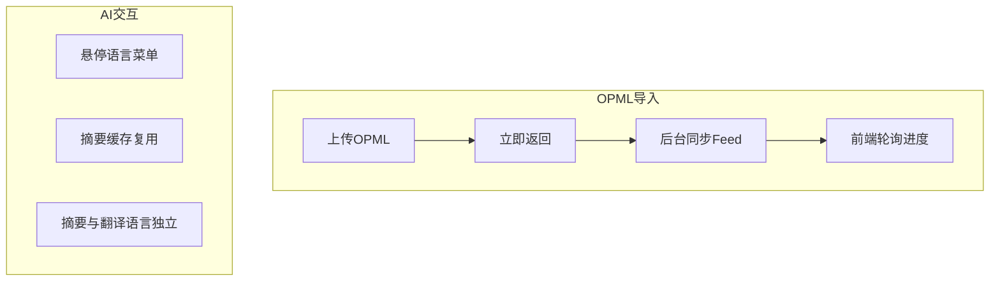

# test0715 开发进度汇报

> 日期：2026-07-15  
> 代号：test0715  
> 范围：在 test0714 全功能基线上进行体验优化与 AI 交互增强  
> 仓库路径：`test/test0715`

---

## 1. 本阶段目标

在功能完备的前提下，重点解决 **导入阻塞 UI**、**AI 操作易用性**、**三栏布局可调** 三类体验问题，使 RSS 阅读器更接近可演示、可日常使用的成品状态。

---

## 2. 已完成工作

### 2.1 OPML 导入线程分离

- 导入接口立即返回 `job_id`，Feed 同步在后台执行
- 新增 `GET /api/opml/import-status/{job_id}` 进度查询
- 前端轮询状态栏显示「已同步 x/y 源」
- 导入过程中界面保持可交互，不再长时间卡死

### 2.2 三栏布局与显示设置

- 左 / 中 / 右栏之间增加 `Resizer` 拖拽分隔条
- 栏宽持久化到 `reading_preferences`（`left_width` / `middle_width`）
- TopBar「显示设置」弹窗聚合字号与主题选择
- 统一三栏 `.pane-head` 高度 42px，标题横线对齐
- 阅读区操作按钮单行横向滚动，避免头部被撑高

### 2.3 AI 摘要 / 翻译交互

- 按钮文案：`AI 摘要`、`AI 翻译`（悬停弹出语言菜单）
- 摘要与翻译目标语言分别记忆，互不影响
- 已有同语言摘要缓存时，再次点击仅展开面板，不重复调 API
- 「重新翻译」仅在进入双语对照模式后显示
- AI 设置弹窗内表单项高度统一

### 2.4 订阅源与安全性

- OPML 导入 / 导出按钮移至左侧订阅源栏（图标 + 文字）
- 删除订阅源增加 `ConfirmModal` 二次确认
- 显示设置 / AI 设置弹窗提升至 App 层级，正确屏蔽阅读区按钮

### 2.5 工程交付

- 代码上传至 `test` 分支 `test0715/`
- README 更新日志记录 2026-07-15 全部改动

---

## 3. 主要新增 / 修改文件

| 文件 | 改动 |
|------|------|
| `components/Resizer.tsx` | 三栏宽度拖拽 |
| `components/AiActionButton.tsx` | AI 悬停语言菜单 |
| `components/DisplaySettingsModal.tsx` | 显示设置弹窗 |
| `components/ConfirmModal.tsx` | 删除确认弹窗 |
| `backend` OPML 路由 | 后台任务与进度 API |
| `App.tsx` | 弹窗层级、栏宽持久化 |

---

## 4. 验证情况

- `./run.sh` 启动正常，访问 `http://127.0.0.1:6789`
- OPML 大文件导入时 UI 不冻结，状态栏可见同步进度
- AI 摘要 / 翻译语言切换与缓存复用符合预期
- 三栏拖拽后刷新页面布局保持

---

## 5. 已知限制与后续

- 仍为开发态 Web 应用，需本机安装 Python + Node 才能 `run.sh`
- 未做法务级代码签名
- AI 功能依赖用户自行配置 Provider

**下一步（0716）**：将 Web 应用打包为 macOS DMG，实现「下载即用」。

---

## 6. 本日改动摘要

| 类别 | 条目数 |
|------|--------|
| 后端 | OPML 异步导入 + 进度 API |
| 前端 UI | 三栏拖拽、显示设置、确认弹窗、OPML 按钮迁移 |
| AI 交互 | 悬停选语言、缓存复用、重新翻译显示逻辑 |
| 文档 | README 更新日志 |
