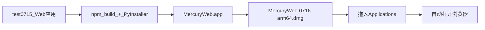

# test0716 开发进度汇报

> 日期：2026-07-16  
> 代号：test0716  
> 范围：Web 应用 macOS 桌面化打包（DMG 分发）  
> 仓库路径：`test/test0716`

---

## 1. 本阶段目标

将 test0715 的完整 Web RSS 阅读器 **包装为 Apple Silicon Mac 可分发安装包**，终端用户无需安装 Python / Node，双击 App 即可在系统浏览器中使用。



---

## 2. 已完成工作

### 2.1 路径与数据目录适配

新增 `backend/app/paths.py`，统一开发态与打包态路径：

| 场景 | 只读资源 | 可写数据 |
|------|----------|----------|
| 开发模式 | 项目根目录 | `data/` |
| 打包模式 | `sys._MEIPASS` | `~/Library/Application Support/Mercury Web/` |

改造 `main.py`、`db.py`、`bootstrap.py` 使用统一路径模块，确保 `.app` 内只读、用户数据可持久化。

### 2.2 打包流水线

| 文件 | 作用 |
|------|------|
| `packaging/launcher.py` | 启动 uvicorn、健康检查、`open` 浏览器、优雅退出 |
| `packaging/mercury.spec` | PyInstaller 配置（datas、hiddenimports、arm64） |
| `packaging/build_dmg.sh` | 一键：前端构建 → 打包 → hdiutil 生成 DMG |
| `packaging/DISTRIBUTION.md` | 给最终用户的安装说明 |

**构建命令：**

```bash
./packaging/build_dmg.sh
```

**产物：**

```text
release/Mercury Web-0716-arm64.dmg
```

### 2.3 运行时行为

- 默认监听 `127.0.0.1:6789`，端口占用时自动尝试相邻端口
- 等待 `/api/health` 就绪后自动打开系统默认浏览器
- 日志写入 `~/Library/Logs/Mercury Web/launcher.log`
- Dock 退出应用时关闭后台 uvicorn

### 2.4 工程交付

- 继承 test0715 全部功能（清洗、AI、OPML、三栏布局等）
- README 补充项目结构与 DMG 构建章节
- 代码上传至 `test` 分支 `test0716/`，提交说明：WEB 包装成 DMG

---

## 3. 技术选型说明

| 环节 | 方案 | 理由 |
|------|------|------|
| 运行时打包 | PyInstaller onedir + `.app` | 与现有 Python/FastAPI 栈一致，改动最小 |
| 界面展示 | 系统浏览器 | 不引入 Electron，包体积约 29MB |
| 架构 | arm64 only | 面向 Apple Silicon 课程演示 |
| 分发格式 | DMG + Applications 别名 | macOS 常规安装体验 |

未采用 Electron / Tauri，避免重写前端壳层；未做 Apple 公证签名（课程作业范围）。

---

## 4. 验证情况

- `./packaging/build_dmg.sh` 构建成功
- 打包后 `/api/health` 返回 `{"ok":true}`
- 首页 HTTP 200，starter OPML 11 源正常导入
- 用户数据写入 Application Support，重启后保留

---

## 5. 使用说明（分发给他人）

1. 打开 `Mercury Web-0716-arm64.dmg`
2. 将 **Mercury Web.app** 拖入 **Applications**
3. 首次若被 Gatekeeper 拦截：右键 → 打开
4. 启动后浏览器自动打开阅读界面

详见 `packaging/DISTRIBUTION.md`。

---

## 6. 已知限制

| 限制 | 说明 |
|------|------|
| 仅 arm64 | Intel Mac 无法原生运行 |
| 未签名 | 首次需右键打开 |
| 依赖浏览器 | 非内嵌 WebView 窗口 |
| 本地服务 | 需保持 App 运行，关浏览器不等于退出 |

---

## 7. 阶段总结


test0716 完成了从「开发态 Web 原型」到「可分发 macOS 安装包」的闭环，为课程演示与同学试用提供了零依赖交付物。
