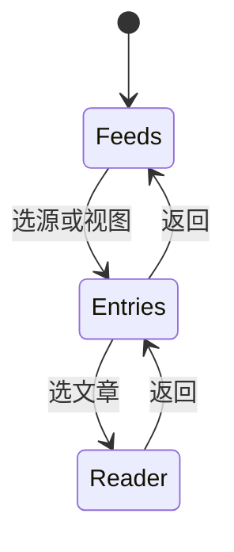

# test0723 开发进度汇报

> 日期：2026-07-23  
> 代号：test0723  
> 范围：在 test0721 基线上新增已读延迟设置与半屏单栏钻入，并同步窄屏控件优化  
> 仓库路径：`test/test0723`

---

## 1. 本阶段目标

解决两类体验问题：

1. **已读时机**：原先点进未读文章即立刻标已读，误触成本高  
2. **半屏布局**：窄屏下三栏纵向堆叠（含 260px 限高）几乎不可用  

目标形态：宽屏保持三栏；窄屏改为「订阅源 → 文章 → 阅读」单栏钻入，并让顶栏 / AI 操作在触控下可用。

---

## 2. 已完成工作

### 2.1 已读设置（显示设置）

- 「显示设置」新增已读延迟滑动条：**0–10 秒**（步进 1）
- **0 秒**：点击后立即标为已读（默认，兼容旧行为）
- **1–10 秒**：停留满设定时间后才 `PATCH is_read`；中途切换文章则取消定时器
- 手动「标为已读 / 未读」与「全部标为已读」不受延迟影响
- 偏好写入 `localStorage`：`rss-mark-read-delay`

### 2.2 半屏单栏钻入（≤860px）

- `App.tsx` 增加 `isNarrow` + `mobilePane`（`feeds` / `entries` / `reader`）
- CSS 按 `data-mobile-pane` 只显示当前栏，去掉窄屏 260px 堆叠
- 文章层 / 阅读层提供「← 订阅源」「← 文章」返回
- 宽屏行为不变

### 2.3 窄屏控件优化

- TopBar：两行布局；显示设置 / AI 设置 / 同步收入 **⋯** 菜单
- 阅读区操作分两行：AI 摘要/翻译；收藏/已读/打开原文
- `AiActionButton` 窄屏改为主按钮执行 + **▾** 选语言（触控可用）
- 双语对照改为上下排；双栏模式 iframe 限高；弹窗与 StatusBar 适配窄屏
- 订阅源 OPML 保留「导入」「导出」文字

### 2.4 打包与文档

- DMG 版本号更新为 **0723**：`Mercury Web-0723-arm64.dmg`
- README / DISTRIBUTION / publish 脚本同步
- Release 标签：`test0723-dmg`

---

## 3. 主要新增 / 修改文件

| 文件 | 改动 |
|------|------|
| `frontend/src/prefs.ts` | `load/saveMarkReadDelay` |
| `frontend/src/components/DisplaySettingsModal.tsx` | 已读设置 UI |
| `frontend/src/App.tsx` | 延迟已读 + 半屏导航状态 |
| `frontend/src/components/TopBar.tsx` | 窄屏两行与 ⋯ 菜单 |
| `frontend/src/components/EntryList.tsx` / `ReaderPane.tsx` | 返回按钮与窄屏操作条 |
| `frontend/src/components/AiActionButton.tsx` | click 模式语言菜单 |
| `frontend/src/styles.css` | 单栏钻入与窄屏样式 |
| `packaging/build_dmg.sh` | VERSION=0723 |
| `README.md` | 已读设置与半屏说明 |

---

## 4. 验证情况

- `./run.sh` / `npm run build` 通过
- 宽屏三栏正常；缩至 ≤860px 可钻入与返回
- 延迟已读：0 秒立即生效，>0 秒切换文章不误标
- `./packaging/build_dmg.sh` 生成 `release/Mercury Web-0723-arm64.dmg`（约 29MB）

---

## 5. 已知限制

| 限制 | 说明 |
|------|------|
| 已读延迟仅本机 | 存 localStorage，不进 SQLite |
| 断点固定 860px | 与历史 CSS 断点对齐 |
| 未做系统返回手势 | 依赖界面返回按钮 |
| DMG 未签名 | 首次仍需右键打开 |

---

## 6. 阶段总结

test0723 补齐了「误触已读」与「半屏可用性」两条体验短板，并保持 macOS DMG 可分发闭环。
