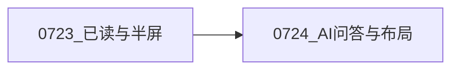

# test0724 开发进度汇报

> 日期：2026-07-24  
> 代号：test0724  
> 范围：在 test0723 基线上将底部摘要坞升级为 **AI 问答**，并补齐划词问 AI、按文章持久化会话、宽屏栏目收起与拖动性能优化  
> 仓库路径：`test/test0724`  
> 产品名：Mercury AI Reader（浏览器标题）/ Mercury Web（DMG 安装包）

---

## 1. 本阶段目标

1. **AI 问答**：多轮流式对话，顶栏「AI 摘要」一键注入；问答坞可上下拖动调高  
2. **划词问 AI**：阅读/双语正文选中后弹出「问AI」，按文章上下文解释选段  
3. **会话持久化**：聊天记录按文章落库；再打开可恢复；支持确认后清空  
4. **布局与交互**：宽屏可收起订阅源 / 全屏阅读；各拖动条跟手、不卡顿  
5. **文档与分发**：README 同步；DMG `Mercury Web-0724-arm64.dmg`

---

## 2. 已完成工作

### 2.1 AI 问答坞（替代原摘要面板）

- 底部「AI 问答」：SSE 流式、多轮气泡、Markdown 渲染；整篇文章作上下文  
- 打开后顶部横条可上下拖动高度（约 160px～父级 70%）；输入框高度固定，仅消息区伸缩  
- 顶栏 **AI 摘要**：向问答坞发送「请根据本篇文章生成{语言}的摘要」并自动打开流式回复  
- 「AI 回复完成」仅在整段 SSE 读完且未出错后显示于右下角状态栏

### 2.2 按文章保存聊天记录

- 表 `entry_chat_messages`（`entry_id` + `seq`）  
- `GET/DELETE /api/ai/chat/{entry_id}`；流式成功结束后整表替换写入  
- 切换文章 / 再展开坞可恢复历史；请求仍带 messages，LLM 具备会话记忆（后端截断最近 20 条）  
- 打开坞后「AI 问答」右侧红色「清空记录」+ 确认弹窗；确认后删库与 UI

### 2.3 划词问 AI

- 阅读视图、双栏左栏（含双语原文/译文）选中文字 → 渐变弹出「问AI」  
- 点击发送：`根据文章解释"…"` 并打开问答坞  
- 取消选区后按钮立即消失；纯网页 / 双栏右栏 iframe（跨域）不支持

### 2.4 翻译与 AI 设置体验

- 翻译 SSE **并行流式**（多段并发，前端按段交错填入）  
- Provider「测试连通」旁状态点：成功绿、失败红、测试中黄闪

### 2.5 宽屏栏目收起（>860px）

- 文章列表标题旁：收起 / 展开「订阅源」  
- 「阅读」旁：收起左两栏全屏阅读 / 恢复布局  
- 半屏无按钮；进入窄屏自动重置收起状态  
- 收起带动画；栏宽保留，展开后还原

### 2.6 拖动条性能与其它 UI

- 三栏 Resizer / 双栏分割 / 问答高度：增量位移 + `requestAnimationFrame`；拖动中禁用 iframe 指针事件  
- 拖动栏宽时临时关闭 `width` CSS 过渡，消除约 200ms 跟手延迟  
- 确认弹窗缩小、去掉右上角重复「取消」  
- 浏览器标题改为 **Mercury AI Reader**

### 2.7 打包与文档

- DMG：`Mercury Web-0724-arm64.dmg`（`packaging/build_dmg.sh` VERSION=0724）  
- `test0724/README.md` 同步上述能力与 API

---

## 3. 主要新增 / 修改文件

| 文件 | 改动 |
|------|------|
| `backend/app/db.py` | `entry_chat_messages` 表 |
| `backend/app/routers/agents.py` | chat GET/DELETE；stream 成功落库 |
| `backend/app/schemas.py` | `ChatHistoryOut` |
| `frontend/src/api.ts` | `getChatHistory` / `clearChatHistory` |
| `frontend/src/components/ReaderPane.tsx` | 问答坞、划词、历史、清空、双栏/问答拖动优化 |
| `frontend/src/components/Resizer.tsx` | ref 回调 + rAF + iframe 防护 |
| `frontend/src/components/PaneCollapseButton.tsx` | 宽屏收起图标按钮 |
| `frontend/src/components/EntryList.tsx` / `App.tsx` | 收起状态与布局 |
| `frontend/src/components/ConfirmModal.tsx` | 紧凑确认框 |
| `frontend/src/styles.css` | 问答拖条、收起、拖动性能相关样式 |
| `frontend/index.html` | 标题 Mercury AI Reader |
| `packaging/build_dmg.sh` | VERSION=0724 |
| `README.md` | 功能说明更新 |

---

## 4. 验证情况

- `npm run build` / `./packaging/build_dmg.sh` 通过  
- 同文多轮问答 → 收起再展开 / 换文再回仍见历史；清空需确认  
- 划词问 AI：阅读与双语可用；网页 iframe 不弹  
- 宽屏收起订阅源 / 全屏阅读；≤860px 无收起按钮  
- 三栏、双栏、问答拖动跟手，网页模式下拖栏宽不再卡顿  
- 产物：`release/Mercury Web-0724-arm64.dmg`（约 29MB）

---

## 5. 已知限制

| 限制 | 说明 |
|------|------|
| 划词不覆盖跨域网页 | 父页面无法读 iframe 选区 |
| LLM 历史截断 | 请求侧最多约 20 条；UI 可展示该文全部持久化消息 |
| 收起状态不持久化 | 仅本会话；窄屏会清零 |
| DMG 未签名 | 首次仍需右键打开 / 隐私与安全性放行 |

---

## 6. 阶段总结

test0724 把阅读器从「摘要 + 翻译」推进到「可记忆的 AI 问答 + 划词解释」，并补齐宽屏专注阅读与拖动手感；macOS DMG 继续可一键分发。
